Инструкция по развертыванию и запуску проекта

Для корректной работы приложения Bloodlily необходимо наличие локального сервера (Apache/Nginx), интерпретатора PHP версии 8.0+ и системы управления базами данных PostgreSQL.
1. Подготовка окружения

    Установите пакет XAMPP, WAMP или OpenServer, включающий PHP и веб-сервер.

    Убедитесь, что в файле конфигурации php.ini раскомментированы расширения для работы с PostgreSQL:

        extension=pdo_pgsql

        extension=pgsql

2. Установка зависимостей

Проект использует шаблонизатор Twig. Для его загрузки:

    Откройте терминал в корневой папке проекта.

    Выполните команду:
    Bash

    composer install

    Это создаст папку vendor со всеми необходимыми библиотеками.

3. Настройка базы данных

    Откройте pgAdmin 4 и создайте новую базу данных (например, bloodlily_db).

    Выполните SQL-скрипт для создания структуры таблиц:
    SQL

    -- Создание таблицы ролей
    CREATE TABLE roles (
        id SERIAL PRIMARY KEY,
        name VARCHAR(50) NOT NULL
    );

    -- Создание таблицы пользователей
    CREATE TABLE users (
        id SERIAL PRIMARY KEY,
        username VARCHAR(50) UNIQUE NOT NULL,
        password_hash TEXT NOT NULL,
        role_id INTEGER REFERENCES roles(id)
    );

    -- Создание таблицы товаров
    CREATE TABLE products (
        id SERIAL PRIMARY KEY,
        title VARCHAR(255) NOT NULL,
        description TEXT,
        price DECIMAL(10, 2),
        category VARCHAR(100),
        user_id INTEGER REFERENCES users(id)
    );

    -- Наполнение начальными данными
    INSERT INTO roles (name) VALUES ('admin'), ('user');

4. Конфигурация подключения

Откройте файл db.php в корне проекта и укажите ваши данные для подключения к PostgreSQL:
PHP

$host = 'localhost';
$db   = 'bloodlily_db';
$user = 'postgres';
$pass = 'ваш_пароль'; // Например, 1111

5. Запуск

    Поместите папку с проектом в директорию htdocs (для XAMPP).

    Запустите модули Apache и PostgreSQL в панели управления сервером.

    Откройте браузер и перейдите по адресу: http://localhost/bloodlily/

Сценарий тестирования для проверки работоспособности

Для демонстрации работы проекта в отчете рекомендуется выполнить следующие шаги:

    Регистрация: Создайте нового пользователя через форму регистрации. По умолчанию ему будет присвоена роль user.

    Авторизация: Войдите в систему. Убедитесь, что в шапке сайта появилось ваше имя пользователя.

    Добавление данных: Добавьте новый товар. Проверьте, появился ли он в общем каталоге на главной странице.

    Проверка прав: Попробуйте зайти на страницу admin.php. Система должна выдать «Доступ запрещен», так как у вас роль обычного пользователя.

    Администрирование: Измените в БД через pgAdmin роль вашего пользователя на admin (как мы делали ранее), перезайдите в аккаунт и убедитесь, что доступ к панели управления открылся.

1. Теоретическая часть

В данной работе рассматривается разработка веб-приложения средней сложности с использованием серверной логики, базы данных и пользовательского интерфейса.
Веб-приложение представляет собой программную систему, работающую через браузер и обеспечивающую взаимодействие пользователей с сервером посредством HTTP-запросов.
В проекте используются следующие технологии:
•	PHP — серверная логика;
•	PostgreSQL — реляционная база данных;
•	HTML/CSS/JavaScript — пользовательский интерфейс;
•	Bootstrap — оформление интерфейса;
•	REST API — взаимодействие между клиентом и сервером;
•	Git/GitHub — система контроля версий.
Основные преимущества выбранного подхода:
•	удобное хранение данных;
•	высокая расширяемость;
•	разделение клиентской и серверной логики;
•	поддержка многопользовательского режима.

2. Формулировка задачи
Необходимо разработать веб-приложение, содержащее серверную часть, систему хранения данных и пользовательский интерфейс.
Приложение должно:
•	обеспечивать авторизацию пользователей;
•	поддерживать работу с базой данных;
•	реализовывать CRUD-операции;
•	иметь удобный интерфейс;
•	обеспечивать обработку пользовательских запросов;
•	хранить данные в PostgreSQL;
•	поддерживать API или серверную обработку данных.

Сценарии взаимодействия пользователей

Сценарий 1 — Авторизация
1.	Пользователь открывает сайт.
2.	Переходит на страницу входа.
3.	Вводит логин и пароль.
4.	Сервер проверяет данные.
5.	Пользователь получает доступ к системе.

Сценарий 2 — Добавление записи
1.	Пользователь нажимает кнопку «Добавить».
2.	Заполняет форму.
3.	Данные отправляются на сервер.
4.	Сервер сохраняет данные в PostgreSQL.
5.	Запись отображается в интерфейсе.

Сценарий 3 — Редактирование данных
1.	Пользователь выбирает запись.
2.	Изменяет данные.
3.	Отправляет форму.
4.	Сервер обновляет данные в БД.

Структура базы данных

Таблица users:
Поле	Тип	Описание
id	SERIAL	Идентификатор
username	VARCHAR	Логин
email	VARCHAR	Email
password	VARCHAR	Пароль

Таблица items:
Поле	Тип	Описание
id	SERIAL	Идентификатор
title	VARCHAR	Название
description	TEXT	Описание
created_at	TIMESTAMP	Дата создания

Связи между таблицами
•	Один пользователь может иметь несколько записей.
•	Связь реализована через foreign key.

Используемые технологии:
Технология	Назначение
PHP	Серверная логика
PostgreSQL	База данных
HTML/CSS	Интерфейс
JavaScript	Динамика интерфейса
Bootstrap	Стилизация
GitHub	Хранение проекта

Примеры реализации основных функций
Подключение к базе данных PostgreSQL
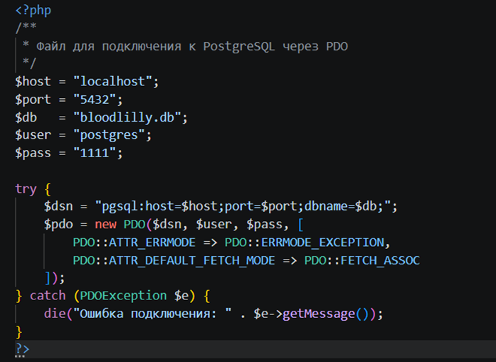
 
Объяснение
Данный код реализует подключение приложения к базе данных PostgreSQL с использованием PDO.
Использование PDO обеспечивает:
•	безопасность; 
•	поддержку prepared statements; 
•	обработку ошибок; 
•	совместимость с различными СУБД. 

Реализация авторизации пользователя
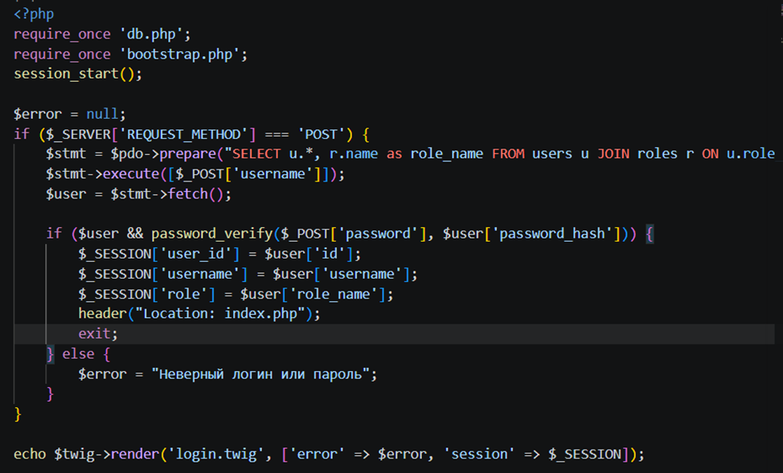
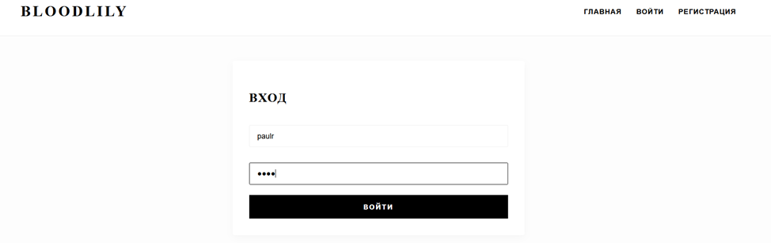
 Объяснение
В данном фрагменте:
•	пользователь вводит email и пароль; 
•	выполняется поиск пользователя в базе данных; 
•	пароль проверяется через password_verify(); 
•	после успешного входа создаётся пользовательская сессия. 

Добавление новой записи
 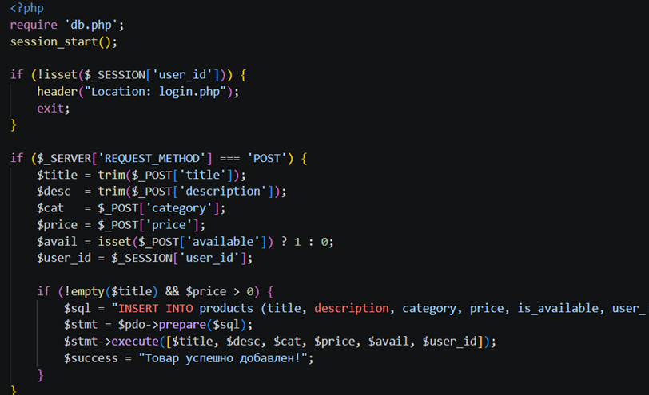

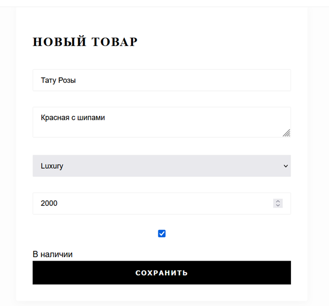
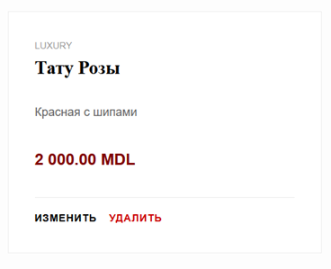
Объяснение
Этот код реализует операцию Create из CRUD.
Функция позволяет:
•	получать данные из HTML-формы; 
•	сохранять данные в PostgreSQL; 
•	использовать безопасные SQL-запросы. 

Получение данных из базы
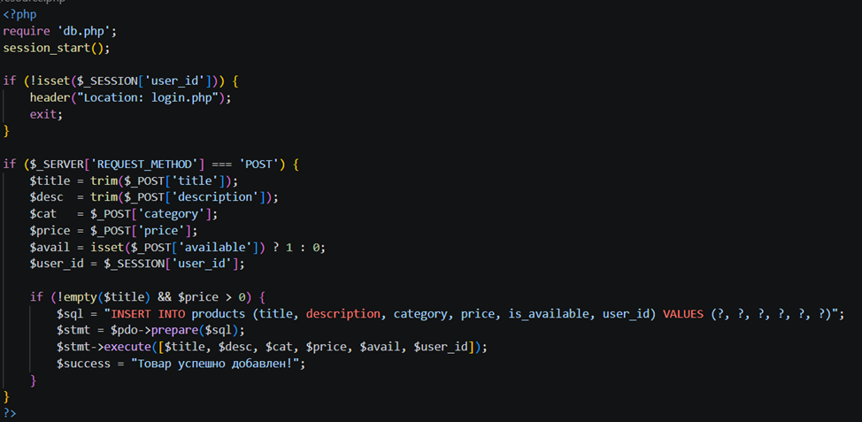
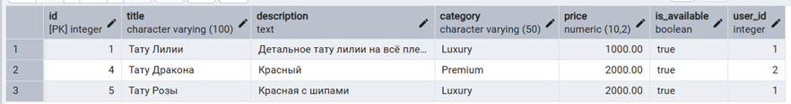
 Объяснение
Данный код выполняет:
•	получение данных из таблицы; 
•	сортировку записей; 
•	вывод информации пользователю. 

Удаление записи
 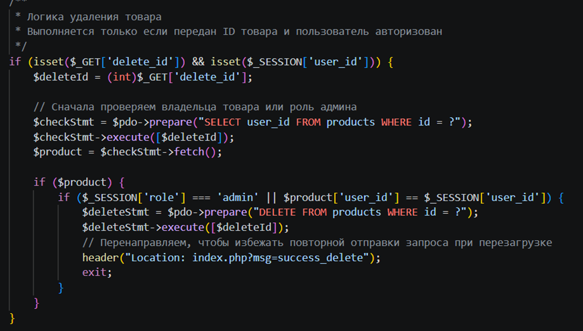
 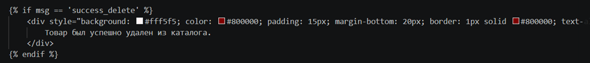
 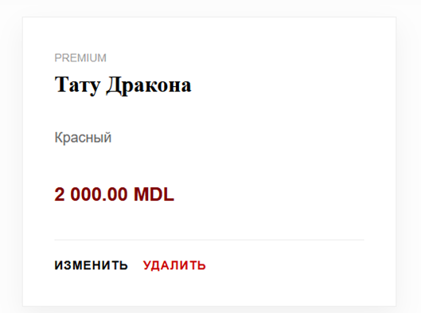
 
 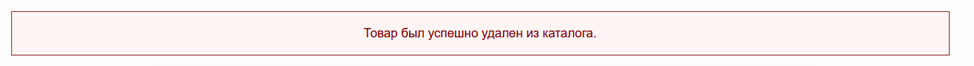
 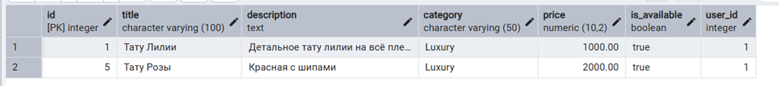
Объяснение
Код реализует операцию Delete.
После удаления выполняется перенаправление пользователя на главную страницу.

SQL-скрипт создания таблицы users
 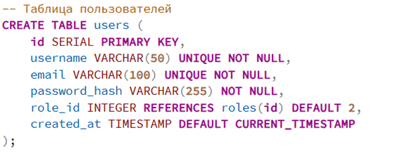
 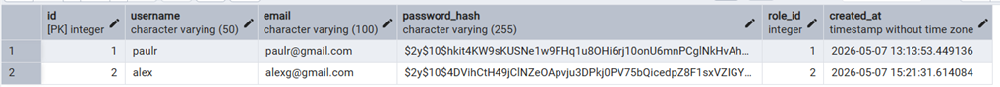
Объяснение
Таблица предназначена для хранения данных пользователей системы.
Используются:
•	PRIMARY KEY; 
•	UNIQUE; 
•	ограничения NOT NULL. 

SQL-скрипт создания таблицы products
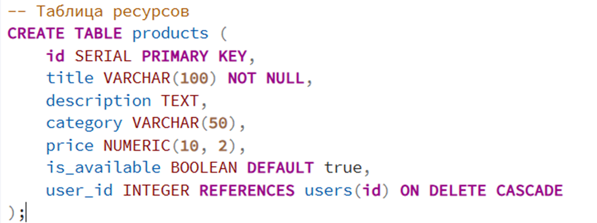
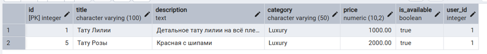
 Объяснение
Таблица хранит пользовательские записи.
Связь между таблицами реализована через:
REFERENCES users(id)
что обеспечивает целостность данных.

Библиография
https://www.php.net/manual/en/language.references.php
https://www.postgresql.org/
https://metanit.com/
https://www.apachefriends.org/
https://habr.com/ru/companies/ruvds/articles/1029698/
https://supabase.com/database
https://www.ibm.com/think/topics/database

