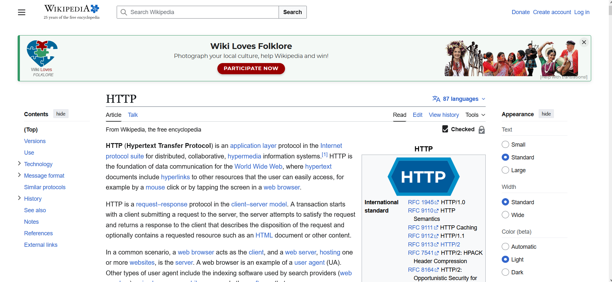
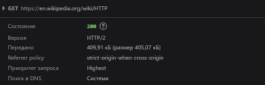
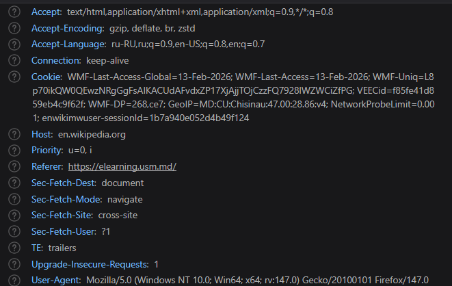
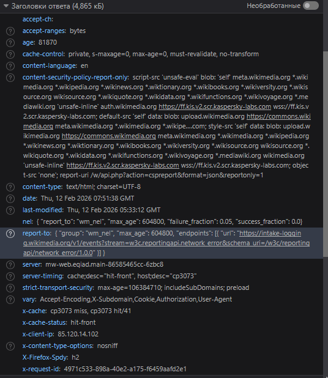
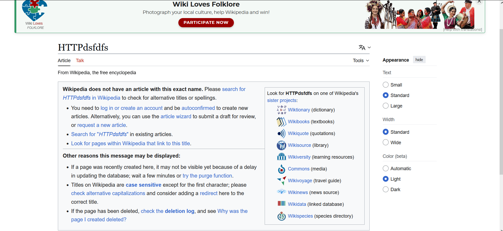
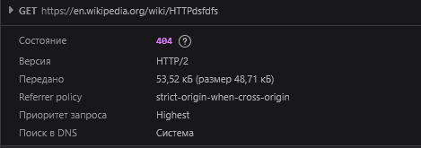
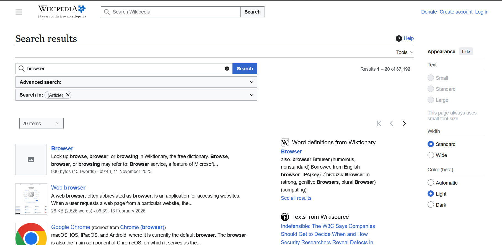
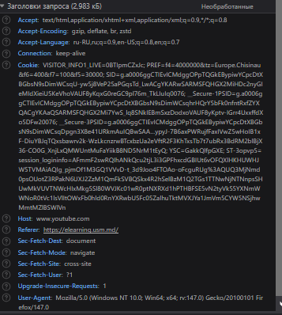
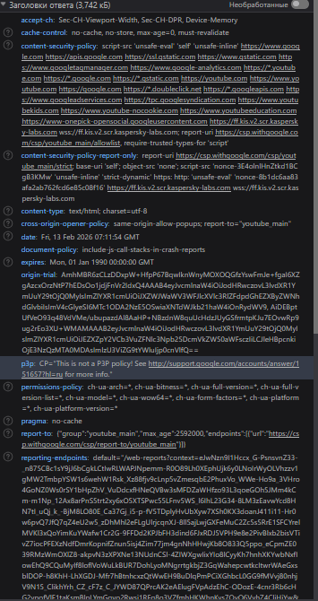

**Лабораторная работа №1. HTTP**

## Задание 1. Анализ HTTP-запросов. Часть 1 ##

Откройте инструменты разработчика в вашем браузере (обычно это можно сделать, нажав F12 или правой кнопкой мыши выбрав "Inspect").

`https://en.wikipedia.org/wiki/HTTP`

**URL запроса**

   " https://en.wikipedia.org/wiki/HTTP "

   Данный URL указывает на страницу со статьёй HTTP в русскоязычной версии сайта Wikipedia.

**Метод запроса** 

`GET` 
GET предназначен для получения ресурса без изменения состояния на сервере.
Когда страница загружается, браузер запрашивает HTML-документ по указанному URL.  

**Статус ответа** 
    
`200 OK` 
200 OK - запрос успешно выполнен, сервер возвращает запрошенный ресурс (в данном случае HTML-страницу статьи про HTTP).

**Заголовки запроса** 

Основные заголовки в запросе:
`Accept` - указывает, какие типы данных может принять клиент  
`Accept-Language` - задаёт предпочтительный язык содержимого  
`Accept-Encoding` - определяет способы сжатия данных  
`Cookie` - используется для хранения сессионных данных  
`Referer` - указывает страницу, с которой был выполнен переход
`User-Agent` - содержит информацию о браузере и операционной системе пользователя 

**Заголовки ответа**

Основные заголовки в ответе:
`Content-Type` - определяет тип возвращаемых данных (HTML)  
`Content-Encoding` - указывает, что данные передаются в сжатом виде  
`Content-Length` - размер тела ответа  
`Cache-Control` - управляет кэшированием данных  
`Server` - информация о сервере  

**Тело запроса и ответа**

Тела запроса нет, так как здесь используется метод GET.  
Тело ответа содержит HTML-код веб-страницы, который используется браузером для отображения содержимого статьи.

## Вывод ##  

По итогам анализа можно заключить, что при открытии страницы Wikipedia отправляется стандартный HTTP-запрос с методом GET, а сервер возвращает успешный ответ со статус-кодом 200.

## Задание 1.1 Анализ HTTP-запросов. ##

Анализ HTTP-запроса страницы  
"https://en.wikipedia.org/wiki/HTTPdsfdfs"

**URL запроса**

 https://en.wikipedia.org/wiki/HTTPdsfdfs  

Данный URL указывает на страницу с названием «HTTPdsfdfs» в англоязычной версии сайта Wikipedia.  
Однако страница с таким названием отсутствует на сервере.

**Метод запроса**

`GET ` 
Метод GET используется для получения данных с сервера.  
При загрузке страницы браузер запрашивает HTML-документ по указанному URL.  
Запрос не изменяет данные на сервере и применяется исключительно для получения информации.

**Статус ответа**

`404 Not Found ` 

Сервер успешно обработал запрос, однако не нашёл запрашиваемый ресурс.  
В данном случае страница с таким названием отсутствует на сайте.

**Заголовки запроса**

`Accept` - форматы данных, которые браузер может принять  
`Accept-Language` - предпочтительный язык контента  
`Accept-Encoding` - поддерживаемые методы сжатия  
`Cookie` - сессионные данные и настройки пользователя  
`Referer` - адрес страницы, с которой был выполнен переход  
`User-Agent` - информация о браузере и операционной системе пользователя

**Заголовки ответа**

`Content-Type` - тип контента (text/html; charset=UTF-8)  
`Content-Encoding` - данные передаются в сжатом виде  
`Cache-Control` - управление кэшированием страницы  
`Content-Length` - размер ответа  
`Server` - информация о сервере  

**Тело запроса и ответа**

Тела запроса нет, так как используется метод GET.  
Тело ответа содержит HTML-страницу с сообщением об ошибке 404 - «Страница не найдена».

## Вывод ##

При попытке перейти по данному адресу сервер отвечает кодом 404 Not Found, что означает отсутствие запрашиваемого ресурса на сервере.

## Задание 2. Анализ HTTP-запросов. Часть 2 ##

В данном задании был проведён анализ HTTP-запроса, выполняемого при поиске информации на сайте Wikipedia.

**URL запроса:**

https://en.wikipedia.org/w/index.php 

Данный URL используется для обработки поисковых запросов на сайте Wikipedia.

**Метод запроса:**

`GET`  
Метод GET используется для получения данных с сервера.  
Поиск не изменяет данные на сервере, поэтому применяется данный метод.

**Query Parameters:**

При выполнении поискового запроса передаются следующие параметры:
`search=browser` - ключевое слово для поиска  
`title=Special:Search` - страница обработки поискового запроса  
`fulltext=Search` - тип выполняемого поиска  

Параметры передаются в URL и используются сервером для формирования результатов поиска.

## Вывод ##

Поиск на сайте Wikipedia осуществляется с помощью HTTP-запроса методом GET, при котором параметры передаются непосредственно в строке URL.

## Задание 3. Анализ HTTP-запросов. Часть 3 ##

В данном задании был проанализирован HTTP-запрос, который отправляется браузером при загрузке страницы  
"https://www.youtube.com"

**URL запроса:**

 https://www.youtube.com  

Данный URL указывает на главную страницу видеохостинга YouTube.

**Метод запроса:**

`GET`  
Метод GET используется для получения данных с сервера.  
При загрузке страницы браузер запрашивает HTML-документ по указанному URL.  
Запрос не изменяет данные на сервере и применяется исключительно для получения информации.

**Статус ответа**

`200 OK (from service worker)`
Статус 200 означает успешную обработку запроса.  
Указание «from service worker» говорит о том, что ответ был возвращён через механизм кэширования Service Worker.

**Заголовки запроса**

`User-Agent` — информация о браузере и операционной системе пользователя  
`Upgrade-Insecure-Requests` — предпочтение использования HTTPS  

**Заголовки ответа**

`Content-Type` — тип возвращаемых данных (text/html)  
`Content-Encoding` — данные передаются в сжатом виде (br)  
`Cache-Control` — управление кэшированием страницы  
`Strict-Transport-Security` — принудительное использование HTTPS  
`Content-Security-Policy` — правила безопасности загрузки ресурсов  
`X-Frame-Options` — ограничение встраивания страницы  
`Server` — информация о сервере  

**Тело запроса и ответа**

Тела запроса нет, так как используется метод GET.  
Тело ответа содержит HTML-код веб-страницы, который используется браузером для отображения содержимого.

## Задание 4. Составление HTTP-запросов ##

1. Составьте GET-запрос к серверу по адресу http://sandbox.usm.com, указав в заголовке User-Agent ваше имя и фамилию.

**GET-запрос:**

GET / HTTP/1.1
Host: sandbox.usm.com
User-Agent: Pavel Rogalin

- Что такое User-Agent? 

User-Agent — это строка, которая сообщает серверу: какой браузер используется
какая ОС или какой клиент отправляет запрос

Используется для:
аналитики
адаптации контента
логирования

**POST-запрос:**
POST /cars HTTP/1.1
Host: sandbox.usm.com
Content-Type: application/x-www-form-urlencoded
User-Agent: Pavel Rogalin

make=Toyota&model=Corolla&year=2020

**PUT-запрос:**
PUT /cars/1 HTTP/1.1
Host: sandbox.usm.com
User-Agent: Pavel Rogalin
Content-Type: application/json

{
 "make": "Toyota",
 "model": "Corolla",
 "year": 2021
}

- Разница между PUT и PATCH
PUT	PATCH
Обновляет весь ресурс полностью.	
Обновляет часть ресурса
Заменяет данные	
Частично изменяет данные

Пример:
PUT — полностью заменить машину
PATCH — изменить только год

Возможный ответ сервера
HTTP/1.1 201 Created
Content-Type: application/json

{
  "id": 1,
  "make": "Toyota",
  "model": "Corolla",
  "year": 2020
}

- Когда сервер может вернуть разные коды?
200 OK	Успешная обработка
201 Created	Ресурс создан
400 Bad Request	Неверные данные
401 Unauthorized	Нет авторизации
403 Forbidden	Доступ запрещён
404 Not Found	Ресурс не найден
500 Internal Server Error	Ошибка на сервере

- Другие методы HTTP
GET	Получение данных
POST	Создание ресурса
PUT	Полное обновление
PATCH	Частичное обновление
DELETE	Удаление ресурса
HEAD	Получение заголовков без тела
OPTIONS	Получение поддерживаемых методов
