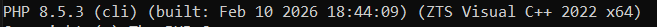
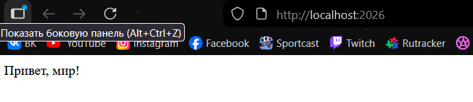
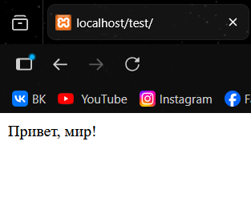
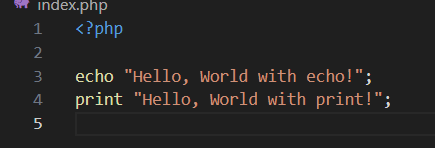
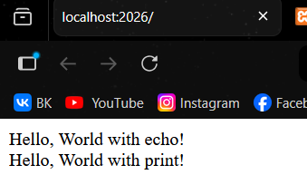
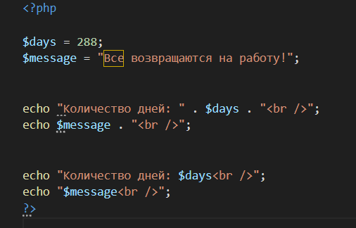
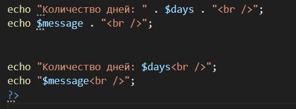
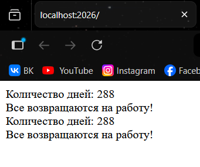

## Шаг 1: Установка PHP ##

    Перейдите на официальный сайт PHP: https://www.php.net/downloads.

    Загрузите актуальную версию PHP для вашей операционной системы.

    Распакуйте архив в удобное место, например: C:\Program Files\php.

    Добавьте путь к PHP в переменные среды (Path):
        Откройте Параметры системы (Win + R → sysdm.cpl).
        Перейдите в Дополнительно → Переменные среды.
        В разделе Системные переменные выберите Path и добавьте путь C:\Program Files\php.
        Сохраните изменения.

    Проверьте установку, выполнив в командной строке: php -v.

## Шаг 2: Альтернативный способ установки PHP ##

    [!NOTE] Выбери шаг 1 или шаг 2 для установки PHP.

Если вы хотите быстро настроить среду, установите XAMPP:

    Перейдите на сайт: https://www.apachefriends.org.
    Скачайте и установите XAMPP, выбрав компоненты:
        Apache
        PHP
        phpMyAdmin
    Запустите XAMPP Control Panel и включите Apache.
    
    Проверьте работу сервера, открыв http://localhost в браузере.

    

## Шаг 3. Написание первой PHP-программы ##

    Создайте директорию для проекта, например: D:\Projects\PHP\01_Introduction.
    Создайте файл index.php и откройте его в текстовом редакторе.

    Вставьте следующий код:

    <?php

    echo "Привет, мир!";

    Запустите программу с помощью встроенного веб-сервера PHP или с помощью XAMPP.

## Шаг 4. Вывод данных в PHP ##

    Выведите строку "Hello, World!" используя функцию echo и print.

    echo "Hello, World with echo!";
    print "Hello, World with print!";

## Шаг 5. Работа с переменными и выводом ##

    Создайте две переменные:
        Целочисленную переменную $days со значением 288.
        Строковую переменную $message с текстом: Все возвращаются на работу!.

    Выведите значения переменных на экран несколькими способами:
        С использованием конкатенации. Конкатенация - это объединение строк, в PHP используется оператор .:
        С использованием двойных кавычек.
    Используйте переход на новую строку в выводе используя тэг  .

## Контрольные вопросы ##

**Какие способы установки PHP существуют?**
 

Установка отдельно с официального сайта – загрузка с сайта PHP и ручная настройка.

Через готовые сборки серверов:

- XAMPP

**Как проверить, что PHP установлен и работает?**

В командной строке написать php -v 

**Чем отличается оператор echo от print?**

 echo:                                          print:                                          

 Может выводить несколько строк через запятую  Выводит только одну строку                     
 Работает немного быстрее                      Чуть медленнее                                 
 Не возвращает значение                        Возвращает 1 (можно использовать в выражениях) 

