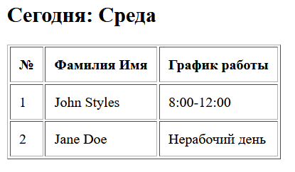
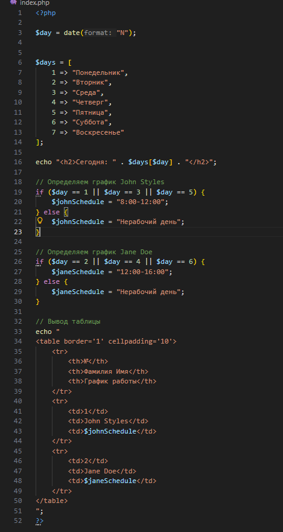
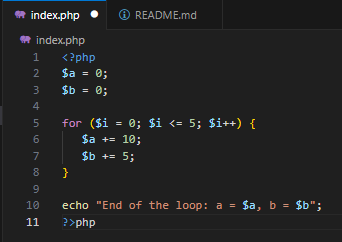
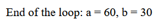
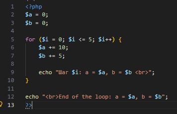
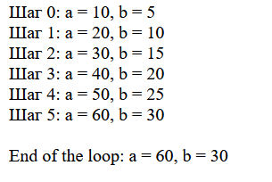
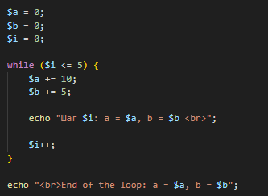
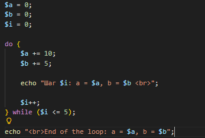
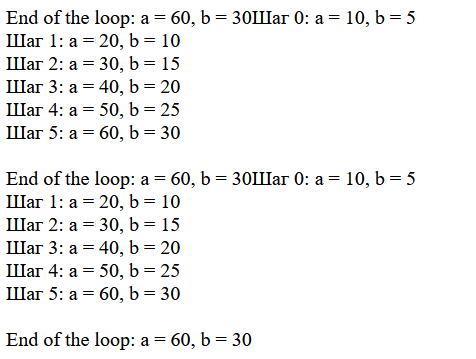

**Условные конструкции**

### 1.Используя функцию date(), создайте таблицу с расписанием, формируемым на основе текущего дня недели. ###


    Для John Styles (xx - xx):
        Если текущий день недели — понедельник, среда или пятница, выведите график работы 8:00-12:00.
        В остальные дни недели выведите текст: Нерабочий день.
    Для Jane Doe (yy - yy):
        Если текущий день недели — вторник, четверг или суббота, выведите график работы 12:00-16:00.
        В остальные дни недели выведите текст: Нерабочий день.





**Циклы**

## Создайте файл index.php со следующим кодом: ##



Вывод


## Добавьте вывод промежуточных значений $a и $b на каждом шаге цикла. ##



Вывод


## Перепишите этот цикл, используя оператор while и do-while. ##
while


do-while


Вывод


***Контрольные вопросы***

## В чем разница между циклами for, while и do-while? В каких случаях лучше использовать каждый из них? ##

**for**

Структура:

for (инициализация; условие; изменение) {
    код
}

Когда использовать:

Когда известно количество повторений
Когда есть счётчик ($i)

**while**

Структура:

while (условие) {
    код
}

Сначала проверяет условие
Потом выполняет код

Когда использовать:

Когда заранее неизвестно количество повторений
Когда цикл зависит от внешнего условия

**do-while**

Структура:

do {
    код
} while (условие);

Сначала выполняет код
Потом проверяет условие

Когда использовать:

Когда код должен выполниться минимум один раз
Например, меню, ввод данных

## Как работает тернарный оператор ? : в PHP? ##

Это короткая форма if-else.

Синтаксис:
условие ? значение_если_true : значение_если_false;

```php
$age = 20;

echo ($age >= 18) ? "Взрослый" : "Ребёнок";
```
Что происходит:
Проверяется $age >= 18

Если да → выводится "Взрослый"
Если нет → выводится "Ребёнок"

## Что произойдет, если в do-while поставить условие, которое изначально ложно? ##

```php
$i = 10;

do {
    echo "Выполнится!";
} while ($i < 5);
```
 
Результат:
Код выполнится 1 раз, даже если условие false.

Потому что:
do выполняется сначала
Проверка условия происходит потом